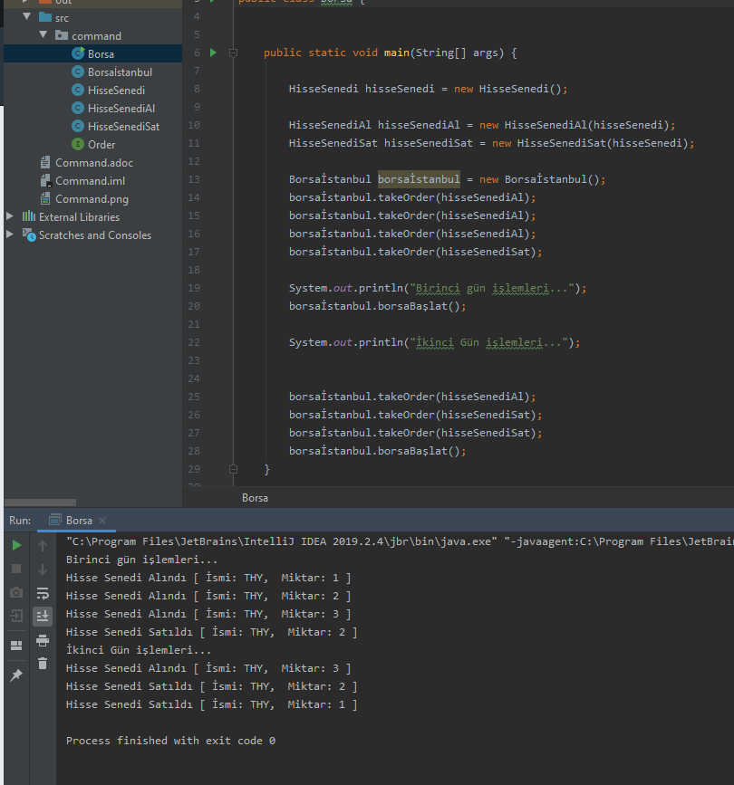

== Coomand Design Pattern

 Bu paternde amaç bir sınıfın sahip olduğu foksiyonları kapsüllemektir. Sınfın fonksiyonlarını çağırmak için yeni sınıflar oluşturulur ve bu sınıflar aracılığıyla ilk sınıfımızın sahip olduğu fonksiyonlar kapsüllenerek çağırılır. 
 
=== Projede kullanma amacımız

 Bu paterni örneklerken borsa yapısı düşünülmüş ve tasarlanmıştır. Hisse senedi almak veya satma işlemi için ayrı güvenlik tedbirleri ve prosedürleri olan 2 sınıfın varlığı kurgulanmış ve HisseSenedi sınıfının içerisinde birer metot olan buy ve sell fonksiyonları için HisseSenediAl ve HisseSenediSat isimli sınıflar oluşturulmuştur. 
 
 Bu sınıflar HisseSenedi tipinde bir nesne tutar(referans gösterir). Daha sonra kendi fonksiyonlarında tuttukları bu referansa ait buy ve sell metotlarını çağırarak bu fonksiyonları faklı sınıflar ile kapsüllemiş olur. Bu kapsüllemenin yapıldığı sınıfların ortak çalıştırılabilmesi içinde Order isminde bir interface tanımlanarak borsadaki işlemler örneklendirilmeye çalışılmıştır. İnsanlar hisse alımı yada satımı yapabilirler. 
 
  Bu kapsüllenen fonksiyonların çalışması için gerekli olan execute fonksiyonu bu Order sınıfı kalıtılarak gerçekleştirilmiştir.  Borsa istanbul ise bu hisse al yada sat işlemlerinin bir listesini tutar ve borsa başladığında bu beklemedeki işlemleri gerçekleştirir.

== Command UML

.Command Uml
[uml,file="Command.png"]
--

interface  Order{
    +execute() : void
}

class HisseSenedi{
    -name : String
    -quantity : int
    --
    --
    + buy() : void
    +sell() : void
}
class HisseSenediAl{
    -hissesenedi : Hissesenedi
    --
    +HisseSenediAl(Hissesenedi)
}
class HisseSenediSat{
    -hissesenedi : Hissesenedi
    --
    +HisseSenediSat(Hissesenedi)
}

class Borsaİstanbul{
   -orderList : List<Order>
   --
   --
   +takeOrder(Order) : void
   +borsaBaşlat() : void
}

HisseSenediAl ..|> Order : <<implements>>
HisseSenediSat ..|> Order : <<implements>>

HisseSenediAl --* HisseSenedi
HisseSenediSat --* HisseSenedi
Borsa -- Borsaİstanbul
Borsaİstanbul"1" -- "*"Order

class Borsa{
    --
    + {static} main()

}

Borsa"1" -- "1"HisseSenedi

--

== Command Tasarım Kalıbı Kod İncelemesi

 Bu tasarım kalıbında asıl amaç bir nesnedeki fonksiyonları başka bir nesne aracılığıyla çalıştırmaktır. Örnek olarak vermek gerekir ise donanım tarafında arka planda nasıl çalıştığını bilmememize rağmen arayüz yada bir buton aracılığı ile yaptığımız işlem classlar aracılığı ile işlenmektedir.

[source,java]
----
public class HisseSenedi { //<1>

    private String name = "THY";
    private int quantity = 0;

    public void buy(){
        quantity++;
        System.out.println("Hisse Senedi Alındı [ İsmi: "+name+",  Miktar: " + quantity +" ] ");
    }
    public void sell(){
        quantity--;
        System.out.println("Hisse Senedi Satıldı [ İsmi: "+name+",  Miktar: " + quantity +" ] ");
    }
}

public class HisseSenediAl implements Order { //<2>
    private HisseSenedi hisseSenedi;

    public HisseSenediAl(HisseSenedi hisseSenedi) {
        this.hisseSenedi = hisseSenedi;
    }

    @Override
    public void execute(){
        hisseSenedi.buy();
    }
}

public class HisseSenediSat implements Order { //<3>
    private HisseSenedi hisseSenedi;

    public HisseSenediSat(HisseSenedi hisseSenedi){
        this.hisseSenedi = hisseSenedi;
    }
    
    @Override
    public void execute() {
        hisseSenedi.sell();
    }
}

public class Borsaİstanbul {  //<4>
    private List<Order> orderList = new ArrayList<>();

    public void takeOrder(Order order){
        orderList.add(order);
    }

    public void borsaBaşlat(){
        for (Order order : orderList){
            order.execute();
        }
        orderList.clear();
    }
}
----
 
<1>  Bu sınıf hisse senedini temsil etmektedir. Ana sınıfımız bu sınıftır bu sınıfın fonksiyonları başka sınıflar aracılığı ile gerçekleştirilecektir.

<2> HisseSenedi sınıfının buy methodunu gerçekleştirmek üzere oluşturulmuş sınıftır içerisinde bir adet hissesenedi nesnesi refere etmektedir. Order interface sini implement eder.

<3> İkinci maddedeki sınıfın hissesenedi sınıfının sell methodu için olan sınıf versiyonudur.

<4> Girilen emirlerin gün başlangıcında gerçekleştirilmesi için çalışan sınıftır. İlk olarak emirleri toplar daha sonra tüm emirleri sıra ile gerçekleştirir.

.Kod Ekran Çıktısı
