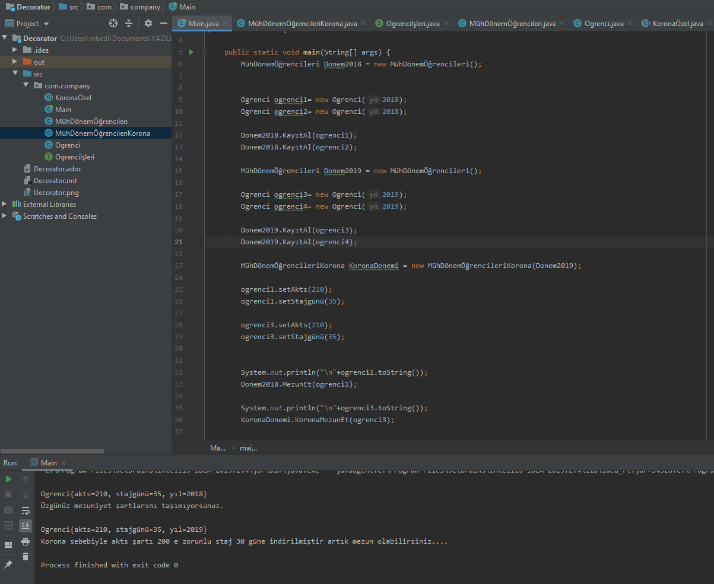

== Decorator Design Pattern

 Bu paternde amaç dinamik olarak nesnelere özellik ekleyebilmemizin sağlanmasıdır. Biz bir interface veya sınıfa bir fonksiyon ekleyerek bunun kalıtım yapan tüm sınıflar ve üretilen tüm nesnelerce kalıtılmasını sağlayabiliyoruz.
 
 Fakat bu sefer isteğimiz tüm sınıfların ve nesnelerin değil sadece üretilmiş bazı nesnelerin bazı ek özellikler alması. Bu yüzden bu patern ile dinamik nesnelerin ek özellikler alması sağlanıyor.
 
=== Projede kullanma amacımız

 Projede paterni örnekler içinde bulunduğumuz korona virüsünden etkilenen eğitim sistemi ve üniversiteleri ele aldık. Normalde her sene için nesne üreten ve öğrencileri kaydeden öğrenci işleri sınıfları var iken 2019 yılındaki öğrencilere özel mezuniyet şartları sağlamak için o yıla ait öğrencilere özel dinamik kapsülleme yapacak bir sistem sağlamak istiyoruz.
 
  Sınıflara veya tüm nesnelere değilde sadece belirli nesnelere dinamik olarak özellik eklemek istediğimiz için bu paterni kullanarak kapsülleme işlemini gerçekleştirirerek koronaya özel mezuniyet şartları sağlanmıştır. Bu sayede Daha az staj günü ve akts ilede 2019 yılındaki öğrenciler mezun olabilmektedir.
  
  2018 yılındaki bir öğrenci ile 2019 yılındaki bir öğrenci aynı akts ve staj gününe sahiptir. Buna rağmen dinamik olarak kapsülleme sağlandığı için 2019 yılındaki öğrenci mezun olabilir iken diğer yıllardaki öğrenciler mezun olamıyor.

== Decorator UML

.Decorator Uml
[uml,file="Decorator.png"]
--

interface  Ogrenciİşleri{
    +ogrenciList : List<Ogrenci> 

    +KayıtAl(Ogrenci) : void 
    +MezunEt(Ogrenci) : void
}

class Ogrenci{
    -akts : int
    -stajgünü : int
    -yıl : int
    --
    +Ogrenci(int yıl) 
    --
    +getAkts() : int
    +setAkts(int akts) : void
    +getStajgünü() : int
    +setStajgünü(int stajgünü) : void
    +getYıl() : int
    +setYıl(int yıl) : void
    +toString() : String
}

class MühDönemÖğrencileriKorona{
    --
    +MühDönemÖğrencileriKorona(Ogrenciİşleri)
    --
    +KoronaMezunEt(Ogrenci) : void
}

class MühDönemÖğrencileri{
    --
    +KayıtAl(Ogrenci) : void
    +MezunEt(Ogrenci) : void

}

abstract class KoronaÖzel{
   -ogrenciİşleri : Ogrenciİşleri
   --
   +KoronaÖzel(Ogrenciİşleri)
   --
}

interface  Ogrenciİşleri{
    +ogrenciList : List<Ogrenci>
    --
    --
    +KayıtAl(Ogrenci) : void
    +MezunEt(Ogrenci) : void
}

class Main{
    + {static} main()
}
MühDönemÖğrencileri ..|> Ogrenciİşleri : <<implements>>
KoronaÖzel ..|> Ogrenciİşleri : <<implements>>

KoronaÖzel <|-- MühDönemÖğrencileriKorona : <<extends>>

Ogrenciİşleri --o KoronaÖzel

Ogrenci"*" -- "1"Ogrenciİşleri

--

== Decorator Tasarım Kalıbı Kod İncelemesi

 Bu tasarım kalıbında asıl amaç bir nesnedeki fonksiyonları başka bir nesne aracılığıyla çalıştırmaktır. Örnek olarak vermek gerekir ise donanım tarafında arka planda nasıl çalıştığını bilmememize rağmen arayüz yada bir buton aracılığı ile yaptığımız işlem classlar aracılığı ile işlenmektedir.

[source,java]
----

public class Ogrenci { //<1>
    private int akts = 0;
    private int stajgünü = 0;
    private int yıl;

    public Ogrenci(int yıl){
        this.yıl = yıl;
    }
    //getter-setter
}

public interface Ogrenciİşleri {   //<2>
 
    public List<Ogrenci> ogrenciList = new ArrayList<>();

    public  void KayıtAl(Ogrenci ogrenci);

    public  void MezunEt(Ogrenci ogrenci);

}

public class MühDönemÖğrencileri implements Ogrenciİşleri {  //<3>

    @Override
    public void KayıtAl(Ogrenci ogrenci) {
       ogrenciList.add(ogrenci);
    }

    @Override
    public void MezunEt(Ogrenci ogrenci) {
        if (ogrenci.getAkts() >= 240  && ogrenci.getStajgünü() >= 50){
            System.out.println("Tebrikler mezun olabilirsiniz....");
        }else{
            System.out.println("Üzgünüz mezuniyet şartlarını taşımıyorsunuz.");
        }
    }
}

public abstract class KoronaÖzel implements Ogrenciİşleri { 

    private Ogrenciİşleri ogrenciİşleri;

    public KoronaÖzel(Ogrenciİşleri ogrenciİşleri){  //<4>
        this.ogrenciİşleri = ogrenciİşleri;
    }

    public void KayıtAl(Ogrenci ogrenci) {
        ogrenciList.add(ogrenci);
    }

    public void MezunEt(Ogrenci ogrenci) { 
        if (ogrenci.getAkts() >= 240  && ogrenci.getStajgünü() >= 50){
            System.out.println("Tebrikler mezun olabilirsiniz....");
        }else{
            System.out.println("Üzgünüz mezuniyet şartlarını taşımıyorsunuz.");
        }
    }

}

public class MühDönemÖğrencileriKorona extends KoronaÖzel {

    public MühDönemÖğrencileriKorona(Ogrenciİşleri ogrenciİşleri) {
        super(ogrenciİşleri);

    }

    public void KoronaMezunEt(Ogrenci ogrenci){  //<5>
        if (ogrenci.getAkts() >= 200  && ogrenci.getStajgünü() >= 30){
            System.out.println("Korona sebebiyle akts şartı 200 e zorunlu staj 30 güne indirilmiştir artık mezun olabilirsiniz....");
        }else{
            System.out.println("Üzgünüz korona mezuniyet şartlarını taşımıyorsunuz.");
        }
    }

}
----
 
<1>  Proje genelinde kullanılmak üzere öğrenci akts staj günü ve mezuniyet yılını tutan bir sınıf yapısı

<2> Üniversitesdeki bölümlerin her yıl öğrencilerinin bilgilerini tutmak için oluşturulan sınıfların yapısını belirlemek için oluşturulan interface.

<3> Mühendislik öğrencilerinin işlemlerini yapmak için oluşturulan her yıl yenisi oluşturulan sınıf. Öğrenci işlerini implement ederek oradaki fonksiyonları override eder.

<4> Dinamik olarak kapsülleme yapmak için 3 numarada bahsettiğimiz sınıftan ürettiğimiz nesneleri vererek özel yapı oluşturacağımız nesneleri üretmek için extend edeceğimiz abstract classın contractor yapısını görüyoruz. Burada dinamik olan nesne alarak kapsülleme işlemi gerçekleştirirlir ve istenilen ek özellikler fonksiyonlar bir sonraki kısımda eklenir.

<5> Dinamik olarak kapsülleme işlemini gerçekleştirdiğimiz kısımdan sonra eklenen fonksiyon burada tanımlanmıştır ve korona dönemine özel staj günü ve akts sayısıyla mezuniyet şartları denenir.

.Kod Ekran Çıktısı
