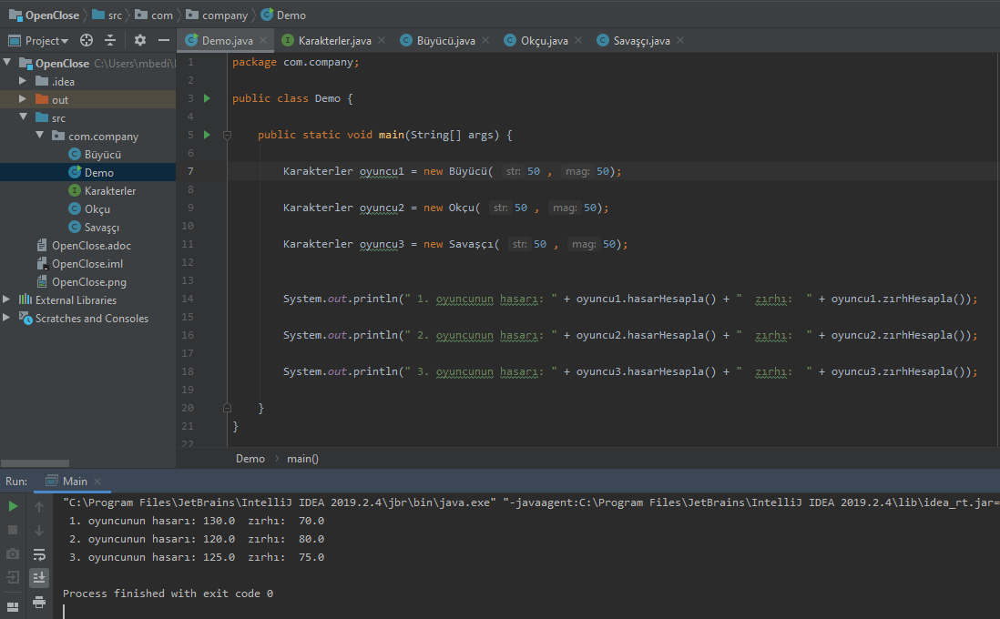

== Solid Prensipleri Nedir

Robert Martin tarafından nesneye yönelik programlamada kullanılması gereken 5 madde olarak sunuldu. Bu prensiplerin asıl amacı daha anlaşılır, esnek ve bakımı kolay bir yapı oluşturmaktır. Bu prensipler ise ;  

. S — Single-Responsibility Principle(Tek Sorumluluk Prensibi)
. O — Open-Closed Principle(Açık Kapalı Prensibi)
. L — Liskov Substitution Principle ( Liskov’un Yerine geçme Prensibi)
. I — Interface Segregation Principle ( Arayüz Ayrımı Prensibi)
. D — Dependency Inversion Principle ( Bağımlılıkların Terslenmesi Prensibi)

şeklindedir. Bu prensiplerden Open-Closed Prensibine değinilecektir.

=== Open-Closed Prensibi

 Açık kapalılık özlliği programımızın geliştirmeye açık değişime kapalı olması anlamına gelmektedir. Yani biz bir proje geliştirdikten sonra zaman içerisinde buna güncellemeler veya bir takım geliştirmeler eklemek isteriz. Bu değişikliklerin ana sistemi etkilemeden yapılabilmesi için bu prensip gereklidir. Bu prensip sayesinde var olan sistem değiştirilmeden (kapalılık özelliği) yeni öğeler eklenebilir(açıklık özelliği). 
 
  Fakat open-closed özelliği uygulanacak sistemlerin önceden tasarlanması gerekmektedir. Kodlamaya başlanılmadan önce bu prensibi sağlayacak şekilde bir mimari oluşturulmalı ve o şekilde kodlamalar yapılmalıdır. Özellikle büyük boyutlu projeler için bu çok önemlidir. Proje ilerledikten sonra bu sisteme geçmek çok zordur.

== OpenClose UML

.OpenClose Uml
[uml,file="OpenClose.png"]
--

interface  Karakter{
    +hasarHesapla() : float
    +zırhHesapla() : float

}

class Büyücü{
    -str : int
    -mag : int
    --
    +Büyücü(int,int)
    --
   
}
class Okçu{
    -str : int
    -mag : int
    --
    +Okçu(int,int)
    --
   
}
class Savaşçı{
    -str : int
    -mag : int
    --
    +Savaşçı(int,int)
    --
   
}

class Demo{
    

    +Main() : void

   
}

Büyücü ..|> Karakter : <<implements>>
Okçu ..|> Karakter : <<implements>>
Savaşçı ..|> Karakter : <<implements>>

Demo"*" -- "*"Karakter

--

== OpenClose Prensibi Kod İncelemesi

 

[source,java]
----
public interface Karakterler {  //<1>

    public float hasarHesapla();

    public float zırhHesapla();

}

public class Büyücü implements Karakterler {
    
    @Override
    public float hasarHesapla() { return (float) (1.7 * mag) +   (float) ( 0.9 * str);    } //<2>

    @Override
    public float zırhHesapla() { return (float) (0.3 * mag) +   (float) ( 1.1 * str);    }
}

public class Okçu implements Karakterler {

    
    @Override
    public float hasarHesapla() { return  (float) (1.2 * mag) + (float) (1.2 * str);  } //<2>

    @Override
    public float zırhHesapla() { return  (float) (0.8 * mag) + (float) (0.8 * str);  }
}

public static void main(String[] args) {

        Karakterler oyuncu1 = new Büyücü( 50 , 50);  //<3>
        Karakterler oyuncu2 = new Okçu( 50 , 50);
        Karakterler oyuncu3 = new Savaşçı( 50 , 50);

        System.out.println(" 1. oyuncunun hasarı: " + oyuncu1.hasarHesapla() + "  zırhı:  " + oyuncu1.zırhHesapla()); //<4>
        System.out.println(" 2. oyuncunun hasarı: " + oyuncu2.hasarHesapla() + "  zırhı:  " + oyuncu2.zırhHesapla());
        System.out.println(" 3. oyuncunun hasarı: " + oyuncu3.hasarHesapla() + "  zırhı:  " + oyuncu3.zırhHesapla());

    }

----
 
<1>  Karakterler adında bir interface oluşturularak tüm karakterlerin sahip olması gereken zırh ve hasar miktarının hesaplanacağı fonksiyonlar bu sınıfa eklenmiştir. Bu sayede projenin kapalılık özelliği sağlanmış oluyor. Bu sistemi değiştirmek zorunda kalmıyoruz.

<2> Numaralı işaret aynı isme sahip fakat içeriği farklı olan hasarHesapla() fonksiyonunu işaret etmektedir Karakterler interface ini implements eden oyun karakterleri kendi türlerine özgü katsayılar ile hasarlarını hesaplamaktadır. Daha sonra oyuna aynı şekilde 4. bir karakter eklendiğindede önceyi yapı değiştirilmesine ihtiyaç duyulmadan benzer yöntemlerle oluşturulabilecektir. Buda bize açıklık özelliğini göstermektedir. Bu şekilde kodumuz geliştirilebilmektedir.

<3> Oyuncular istedikleri tipte karakterler üreterek oyuna kaydolmuşlardır. Fark daha iyi anlaşılsın diye oyunculara verilen 100 puanın str ve mag arasında eşit dağıtılmıştır.

<4> Her biri farklı türde olan karakterlerin hasar ve zırh miktarları yazdırılmıştır. Her karakter ve daha sonra eklenecek yeni bir karaktarde bu şekilde aynı fonksiyonlar ile herhangi bir değişiklik yapılmadan zırh ve hasar değerlerini hesaplayabilecektir.

.Kod Ekran Çıktısı
